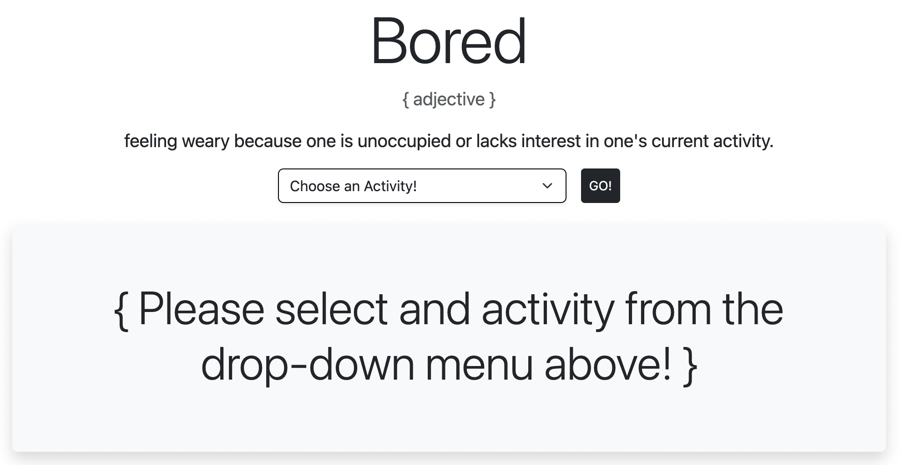
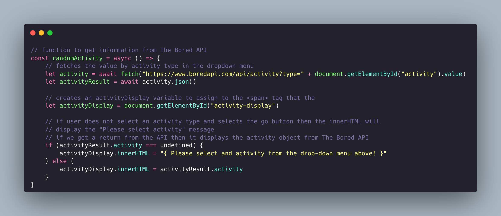

# I'm Bored!
This is a quick little project where I connected to an API and used Bootsrap for the first time.

### Screenshot



## Table of contents
- [Screenshot](#screenshot)
- [Overview](#overview)
  - [Links](#links)
- [My process](#my-process)
  - [Built with](#built-with)
  - [What I learned](#what-i-learned)
  - [Continued development](#continued-development)
  - [Useful resources](#useful-resources)
- [Author](#author)

## Overview
For this project I used [Bootsrap](https://www.getbootstrap.com) to create the HTML and I used [The Bored API](https://boredapi.com) as my first API to work with and connect to.

### Links

- Live Site: [chris-nowicki.github.io/i-am-bored/](https://chris-nowicki.github.io/i-am-bored/)
- Bootstrap [www.getbootstrap.com](https://www.getbootstrap.com)
- The Bored API [www.boredapi.com](https://www.boredapi.com)

### Built with

- Bootsrap
- VS Code

### What I learned

Playing around with Bootsrap is a blast and once you get the hang of it provides a great resource for creating quick websites.  However, connecting to the API was a bit of a challenge *at first*.  I figured out how to connect, create the text for the API response, and created an **IF** statement for if an activity wasn't selected then it directs you to select and activity from the drop-down menu.

Some key code that helped me was the `scripts.js` script:



I'm sure I can do some _refactoring_ once I learn more in the coming months at my [Coding Dojo](http://www.codingdojo.com) bootcamp.

and the `button`

```html
<button class="btn btn-outline-dark ms-3 btn-sm test" type="button" onclick="randomActivity()">GO!</button>
```

### Continued development

- [ ] create an interface to incorporate other objects of The Bored API
      - Accessibility
      - Type
      - Participant
      - Price
- [ ] Refactor Bootsrap and JS code where applicable
- [ ] Make the site more responsive by adjusting the Bootstrap columns for sm, md, and large
- [ ] Create an IOS APP / WIDGET for fun 🥳

### Useful resources / tools

- Carbon [www.carbon.now.sh](http://www.carbon.now.sh) - For creating and sharing beautiful images of source code 😏
- Postman [www.postman.com](https://www.postman.com) - API Platform for creating and using API's

## Author

- Twitter - [@iamwix](https://www.twitter.com/iamwix)
