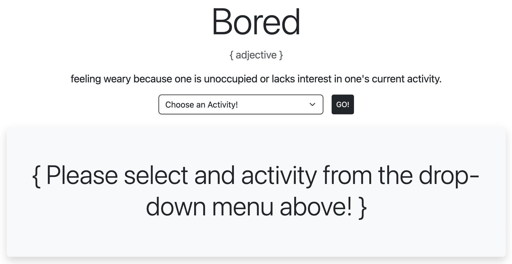

# I'm Bored!
This is a quick little project where I connected to an API and used Bootsrap for the first time.

## Table of contents

- [Overview](#overview)
  - [Screenshot](#screenshot)
  - [Links](#links)
- [My process](#my-process)
  - [Built with](#built-with)
  - [What I learned](#what-i-learned)
  - [Continued development](#continued-development)
  - [Useful resources](#useful-resources)
- [Author](#author)

## Overview
For this project I used [Bootsrap](https://www.getbootstrap.com) to create the HTML and I used [The Bored API](https://theboredapi.com) as my first API to work with and connect to.

### Screenshot

### Links

- Bootstrap [www.getbootstrap.com](https://www.getbootstrap.com)
- The Bored API [www.theboredapi.com)(https://www.theboredapi.com)

### Built with

- Bootsrap
- VS Code

### What I learned

Playing around with Bootsrap is a blast and once you get the hang of it provides a great resource for creating quick websites.  However, connecting to the API was a bit of a challenge *at first*.  I figured out how to connect, create the text for the API response, and created an **IF** statement for if an activity wasn't selected then it directs to select from the drop-down menu.

Some key code that helped me was the `scripts.js` script:

I'm sure I can do some _refactoring_ once I learn more in the coming months at my [Coding Dojo](http://www.codingdojo.com) bootcamp.

### Continued development

[]

### Useful resources

- [Flexbox Crash Course 2022](https://youtu.be/3YW65K6LcIA) - This youtube video was the **AH-HA!** moment that helped me understand the Flexbox layout method.

## Author

- Twitter - [@iamwix](https://www.twitter.com/iamwix)

